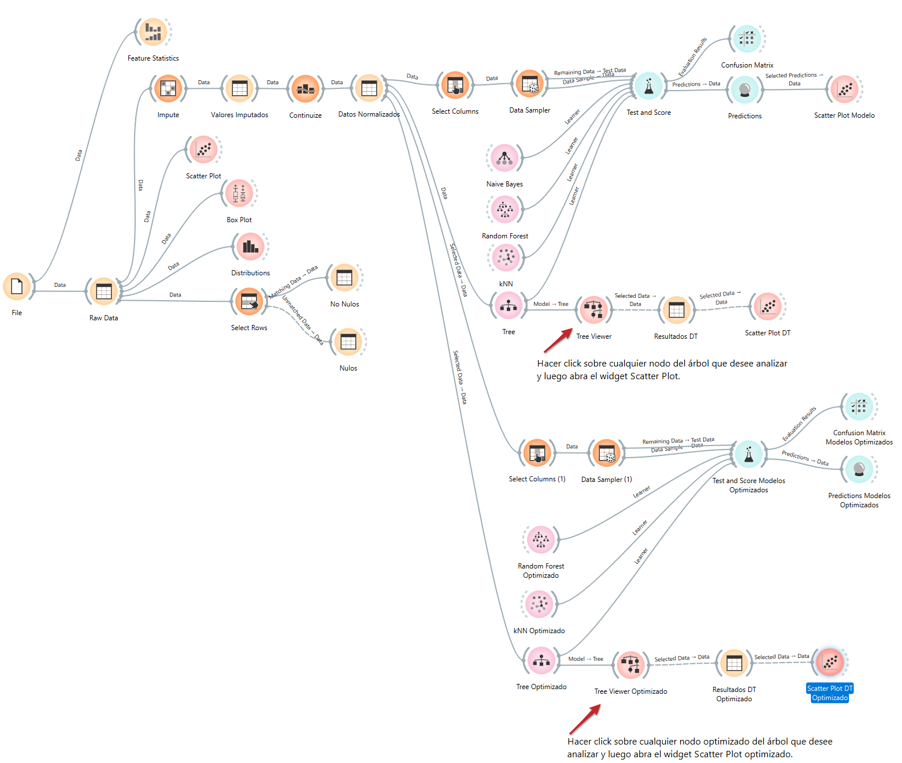

# Mobile Price Range Prediction using Machine Learning

Machine learning classification project developed in Orange Data Mining to predict mobile phone price ranges based on technical device specifications. The project includes data preprocessing, feature analysis, model evaluation, and hyperparameter optimization using kNN, Random Forest, Decision Tree, and Naive Bayes algorithms.

## Tools & Technologies
- Orange Data Mining
- Machine Learning
- Predictive Analytics
- Data Preprocessing
- Classification Models

## Key Insights
- RAM was identified as the most influential feature for price prediction.
- kNN achieved the best overall performance with 92.4% accuracy.
- Multiple classification models were evaluated and optimized to improve predictive performance.

## Workflow



## Repository Contents

```text
mobile-price-prediction/
│
├── README.md
├── technical_report.pdf
├── workflow.png
└── orange_workflow.ows
```
